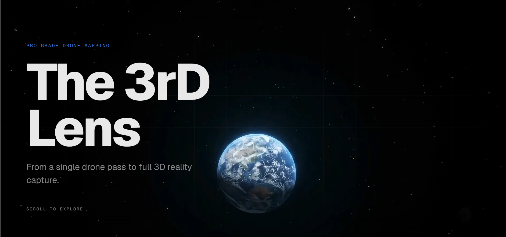
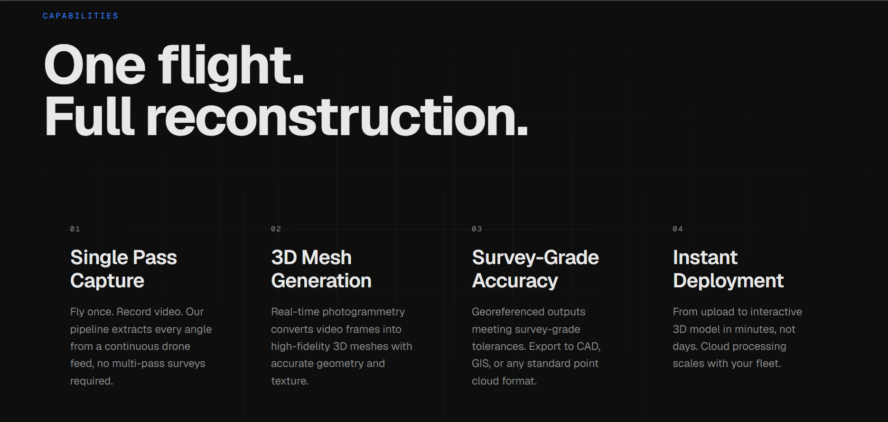
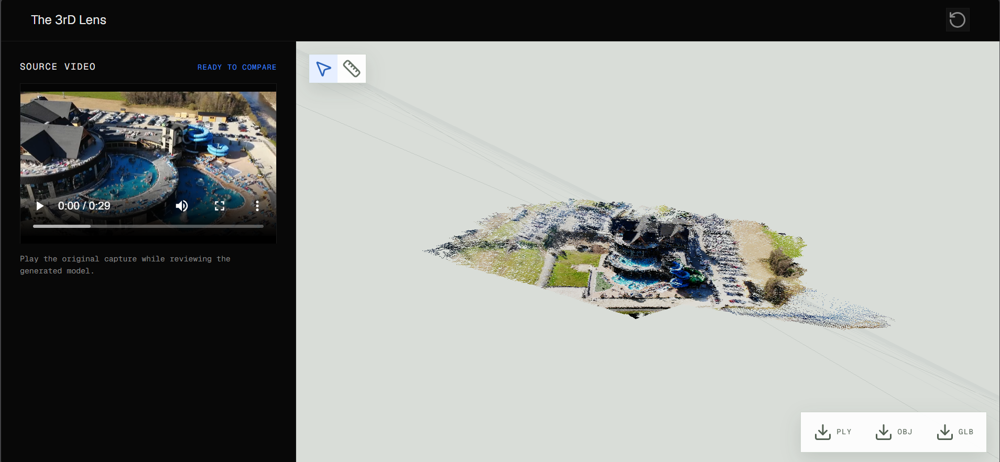

## 1. Project Information

- **Team Name:** CODEVENGERS
- **Project Title:** Single-Pass Drone Video to Accurate 3D Model Generation System
- **PS ID:** 26158
- **PS Title:** Single-Pass Drone Video to Accurate 3D Model Generation System
- **Category:** Software
- **Theme:** Robotics and Drones
- **Deployed Application:** [https://3rdlens.vercel.app](https://3rdlens.vercel.app)

## 2. Problem Statement

Traditional 3D drone mapping typically requires long multi-pass flights, hours of manual processing, and expensive proprietary software that defense teams cannot easily procure. Heavy AI workloads can also crash servers when GPU memory is not managed carefully.

## 3. Proposed Solution

3rDLens, a defense-compliant, browser-based platform that transforms a single drone video into a georeferenced 3D model in under 15 minutes.

It runs the reconstruction pipeline on a single GPU and delivers the result through a browser-based web dashboard.

The operator uploads a drone video and telemetry data. The system extracts key frames, removes moving objects such as cars and pedestrians, estimates camera geometry, generates a 3D surface, and applies GPS data for real-world alignment and measurement.

## Project Screenshots

### 3rDLens landing page

The landing page presents the single-pass drone mapping workflow and the goal of converting one flight into a complete 3D reconstruction.



### Core capabilities

The capabilities view highlights single-pass capture, 3D mesh generation, survey-grade accuracy, and rapid deployment.



### Interactive 3D result viewer

The result view compares the source drone video with the generated 3D model and provides downloads for PLY, OBJ, and GLB assets.



## 4. Key Features

- Single-pass 3D reconstruction from drone video
- Automatic moving-object removal using Meta SAM 2
- DUSt3R-based camera pose and 3D geometry estimation
- 3D Gaussian Splatting with DroneSplat
- GPS/telemetry-based geospatial registration without physical ground control points
- Interactive browser-based 3D viewer with distance measurement
- Export to PLY, OBJ, GLB, LAS, and GeoTIFF formats
- Queued, sequential processing designed for a 24 GB GPU memory budget
- JWT authentication, malware scanning, and SHA-256 file integrity checks

## 5. Technology Stack

- **Languages:** Python, TypeScript, C++
- **Frontend:** Next.js 14, React, Three.js, WebGL
- **Backend & APIs:** FastAPI, WebSockets, REST APIs
- **AI/ML Models:** PyTorch, DUSt3R, Meta SAM 2, DroneSplat
- **3D & Geospatial:** FFmpeg, Open3D, Poisson surface reconstruction, GDAL, PyProj/UTM
- **Infrastructure & Hardware:** Docker, NVIDIA Cloud GPU, NVIDIA L4 or RTX 4090 with 24 GB VRAM
- **Security:** ClamAV malware scanning, SHA-256 integrity checks, JWT authentication

## 6. Architecture

See [docs/architecture.md](docs/architecture.md) for the detailed system design.

```text
Operator
  |
  v
Next.js Web Dashboard
  |
  v
FastAPI REST/WebSocket API
  |
Queued GPU Pipeline
  |
  +--> FFmpeg + GPS/EXIF Telemetry
  +--> DUSt3R Camera Geometry
  +--> SAM 2 Dynamic Object Masks
  +--> DroneSplat Gaussian Splatting
  +--> Open3D/Poisson/GDAL Geospatial Export
  |
  v
Interactive 3D Model and GIS/CAD Assets
```

## 7. Repository Structure

```text
NSUT-SIH-DEMO-main/
├── README.md
├── SUBMISSION_GUIDE.md
├── submission/
│   ├── PRESENTATION.md
│   └── DEMO.md
├── src/
│   ├── backend/
│   │   └── server.py
│   ├── frontend/
│   │   ├── app/
│   │   ├── components/
│   │   └── lib/
│   ├── pipeline/
│   │   ├── run_pipeline.py
│   │   ├── stage1_extract.py
│   │   ├── stage5_export.py
│   │   └── stage6_scale.py
│   └── DroneSplat/
├── docs/
│   └── architecture.md
├── assets/
│   └── screenshots/
│       └── README.md
├── requirements.txt
├── .gitignore
└── LICENSE
```

### What goes where?

| Item | Location |
|---|---|
| Source code | `src/backend/`, `src/frontend/`, `src/pipeline/`, and `src/DroneSplat/` |
| Architecture / technical documentation | `docs/` |
| Project screenshots / hardware photos | `assets/screenshots/` |
| Final PPT / presentation | `submission/` |
| Demo video link | `submission/DEMO.md` |
| Project overview | `README.md` |

## 8. Final Presentation

See [submission/PRESENTATION.md](submission/PRESENTATION.md) for the required format.


## 9. Demo Video

the 3rDLens demo video link in [submission/DEMO.md](submission/DEMO.md).

## 10. Screenshots / Prototype Photos


See [assets/screenshots/README.md](assets/screenshots/README.md) 

## 11. Installation

### Backend and pipeline

```bash
conda create -n 3rdlens python=3.11 -y
conda activate 3rdlens
pip install torch==2.4.0 torchvision==0.19.0 torchaudio==2.4.0 --index-url https://download.pytorch.org/whl/cu121
pip install -r src/requirements_backend.txt
pip install -r src/DroneSplat/requirements.txt
```

Initialize the model submodules and CUDA extensions as described in [src/README.md](src/README.md). Download the DUSt3R and SAM 2 checkpoints before running reconstruction.

### Frontend

```bash
cd src/frontend
pnpm install
pnpm run dev
```

## 12. Run

Start the backend in a second terminal:

```bash
conda activate 3rdlens
cd src/backend
python server.py
```

The API is available at `http://localhost:8000`, with interactive documentation at `http://localhost:8000/docs`. The frontend is available at `http://localhost:3000`. Configure `NEXT_PUBLIC_API_URL` and `NEXT_PUBLIC_BACKEND_ACTIVE=true` in `src/frontend/.env.local` to connect the dashboard to the live backend.


## 13. Future Scope

Realistic future improvements include multi-GPU job scheduling, stronger support for low-light and highly repetitive terrain, automated change detection between surveys, improved orthomosaic generation, offline deployment for disconnected operations, and additional exports for defense, GIS, and CAD workflows. The platform can also be extended with role-based access control, audit logs, and domain-specific model fine-tuning.


