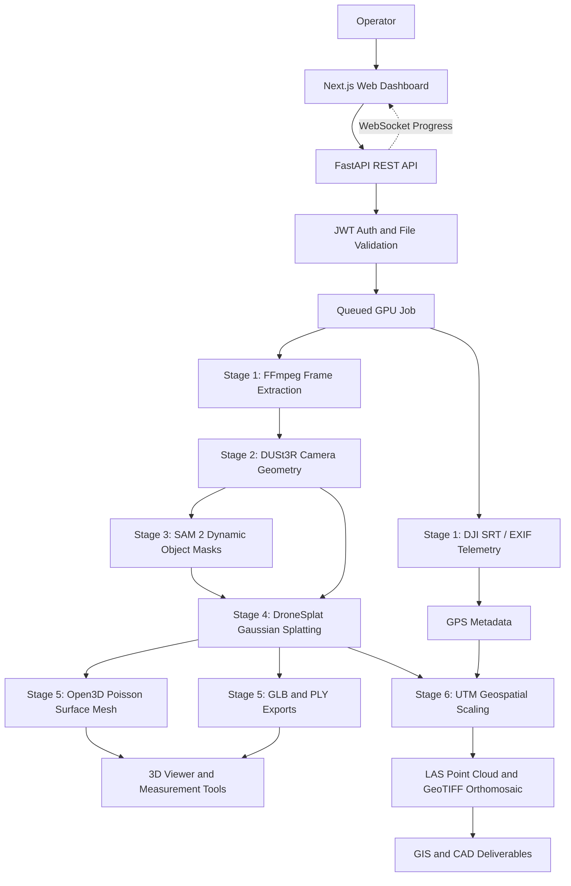

# System Architecture

## High-level flow

## Components

### Frontend
The Next.js and React application provides the landing page, upload workflow, processing status monitor, and interactive Three.js/WebGL viewer. Users can upload drone footage, follow stage-by-stage progress over WebSockets or polling, inspect the generated 3D model, measure distances, and access exported assets.

### Backend API
The FastAPI service authenticates users with JWTs, validates uploaded files, performs malware and integrity checks, creates reconstruction jobs, and exposes REST endpoints for upload, health, status, job history, and asset downloads. A WebSocket endpoint broadcasts live progress updates for each job.

### Input and preprocessing
The operator supplies a drone video in MP4, MOV, AVI, or MKV format and, when available, a DJI SRT flight log or image EXIF metadata. FFmpeg extracts key frames, downscales high-resolution footage, and creates the training and test split. Telemetry parsing produces GPS metadata for later geospatial registration.

### DUSt3R geometry estimation
DUSt3R estimates camera intrinsics, camera poses, and an initial dense point cloud from the extracted frames without depending on a traditional COLMAP feature-matching workflow. The results are written in a COLMAP-compatible representation for downstream reconstruction.

### SAM 2 dynamic masking
Meta Segment Anything 2 generates instance masks for transient foreground objects such as vehicles and pedestrians. These masks prevent moving objects from producing ghosting and artifacts in the final reconstruction.

### DroneSplat reconstruction
DroneSplat trains a 3D Gaussian Splat model from the estimated camera geometry and masked frames. Processing stages run sequentially and release GPU memory between stages so the pipeline remains within the 24 GB VRAM budget available on an NVIDIA RTX 4090 or NVIDIA L4.

### Geospatial and asset export
Open3D and Poisson surface reconstruction produce surface meshes. The system exports web-ready GLB files, colored PLY point clouds, OBJ meshes, LAS LiDAR point clouds, and GeoTIFF orthomosaics. PyProj applies UTM projection and EPSG metadata when GPS telemetry is available; otherwise, the pipeline falls back to local metric coordinates.

### Storage and job delivery
Uploaded videos, intermediate pipeline data, model checkpoints, and exported assets are organized by job and scene. The backend maintains queued and active job state, while the frontend consumes status events and presents the resulting model and downloadable GIS/CAD deliverables.

## Deployment and security

The frontend can be deployed to Vercel at [https://3rdlens.vercel.app](https://3rdlens.vercel.app). The backend runs on a cloud GPU or local NVIDIA workstation and can be exposed to the frontend through a Cloudflare Tunnel. Docker supports reproducible deployment, while JWT authentication, ClamAV malware scanning, SHA-256 integrity checks, and restricted CORS origins protect the upload and processing workflow.
